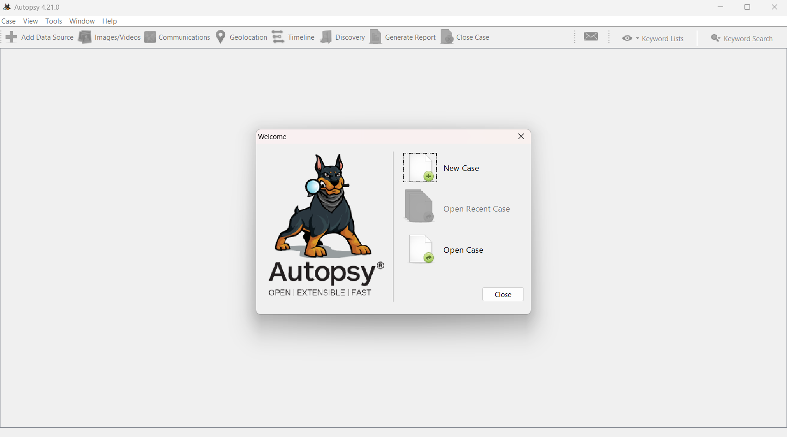
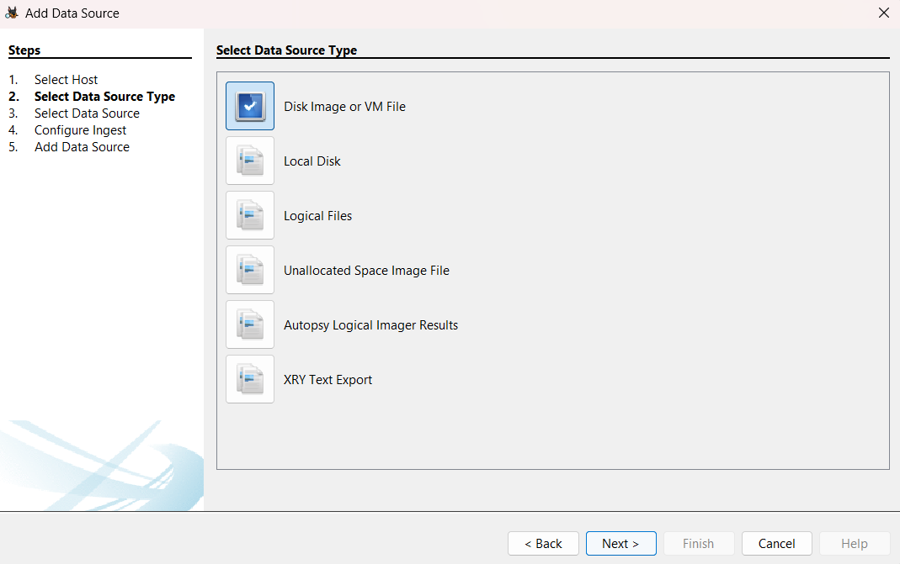
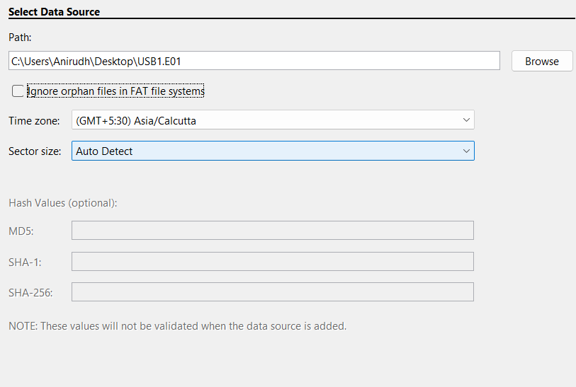
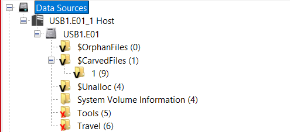
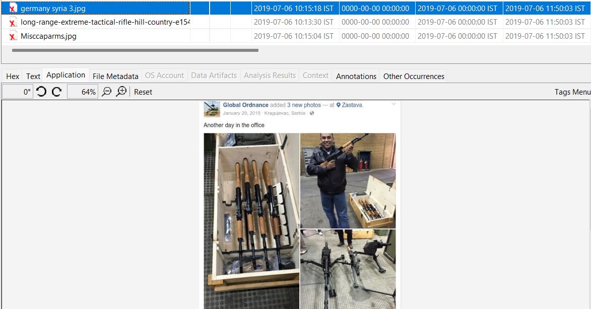
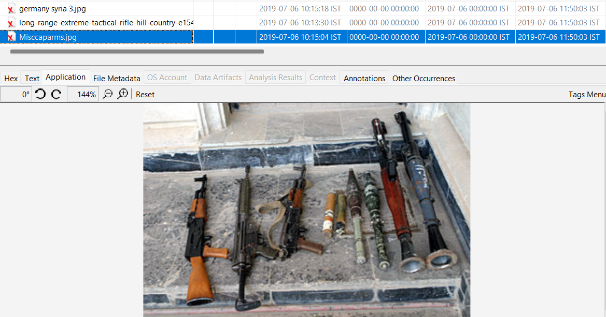
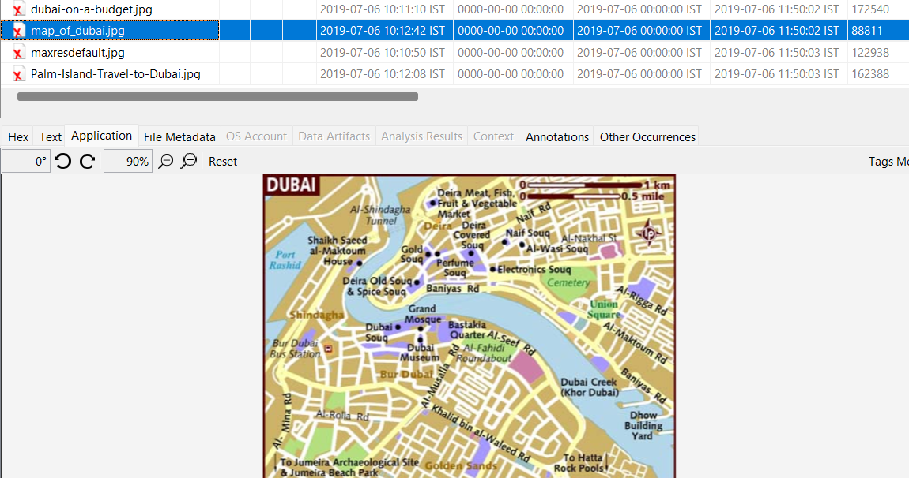

# Introduction to Autopsy

Autopsy is a very powerful, open-source digital forensics tool used to analyze hard drives, smartphones and other forensic images. Autopsy provides a very user friendly GUI that make it very easy to recover and examine evidence like emails, web history, documents and many more files.

## Installing Autopsy

Autopsy is a Windows-only software and can be downloaded from here [Autopsy Website](https://www.autopsy.com/download/)
In this tutorial, we'll walk through how to use Autopsy to solve a very simple and common case which can be downloaded [here](./USB1.E01) if you want to follow along.

This file that we are analyzing is a **`.E01`** file, which is a file format of a forensic image made by the Encase software.

## Solving the Case

### Narrative
A suspect has been accused of traveling to Dubai for arms deals. The subject denies any involvement in arms, or any travel/interest in Dubai. A thumb drive was seized from the subject, which appears to be blank. A forensic image of the thumb drive has been created (USB1.E01)

### Loading the Evidence
On launching Autopsy, this is the screen that greets us. Let's start a new case by clicking on the **`New Case`** button.

We will now be prompted to enter the Case Name and the Base Directory. The Case Name is how we will identify the Case, and the Base Directory is where the Case Information will be stored.

I've created a Case with the name **`USB`** and in the path **`E:\`**

When we make he case, it will ask what kind of Data Source we are using. The most common kind of data source is the Disk Image, because they are the Forensic Images of Hard Disks or Storage Devices. Click on **`Disk Image or VM File`** and load the Encase File into Autopsy.

I've loaded the Encase File and can move on to the next step. In the next step, Configure Ingest, make sure to leave the checkboxes on the default values. After configuring this, Autopsy will load the image into the local database, and now we can start going through the image as though it was a normal computer.

### Starting the Investigation
Since we know that the suspect has been accused of traveling to Dubai and dealing arms, let's go through the files to see if he has been looking to travel to Dubai or any files that prove that he's dealing in arms.

On expanding the first tab, we see that there are some Carved Files, Unallocated Memory, System Volume Information, Tools and Travel.

The **`X`** next to the folders indicate that they are deleted folders and the black **`V`** indicates that they are verified and valid folders.

Let's go through the deleted folders first to see what we can find.

#### Tools Folder

In this tools folder we see that there are 3 images and 2 folders. We do not have to look too much into these folders as they signify **`.`** and **`..`** (current directory and parent directory respectively)

The remaining three files are image files of **`jpg`** format and they have some weird names. On selecting a particular image we see its preview in the `Applications` tab, some strings that are present in the image in the `Strings` tab and the metadata of the file in the `File Metadata` tab.

We notice that there are pictures of various arms present in this particular folder, so we know that there is a link to the suspect and arms.

Now we need to prove that the suspect is going to Dubai in order to trade arms. Let's look into other folders.

#### Travel Folder
This folder is also a deleted folder with many images within it along with **`.`** and **`..`** as well. There are 4 images in this folder and each one is named with a particular reference to Dubai.

With all of this evidence, showing that the suspect is both an arms dealer and has an interest in traveling to Dubai, we can safely conclude that the suspect is guilty of wanting to trade arms in Dubai.

#### Conclusion
This investigation was a very small investigation and exercise. Not all investigations are going to be this easy to solve. In order to learn some more key features and understand what some more of these undiscovered tabs do, read ahead

## Key Points
#### Data Source
The Data Source tab on the left tree displays the basic metadata of all the devices that are connected to the forensic image.

#### Views
##### File Type
This header under the **`Views`** tab can be used to separate the files in the forensic image into two major categories, **`By Extension`** and **`By MIME Type`**.

File Extension tab provides us information about the files that are commonly used by the Operating System while the MIME  Types are used by a browser to decide what data to represent.

This tab also shows deleted files.

###### By Extension
In this category, we see that all the files are segregated into **`Images`, `Videos`, `Audios`, `Archives`, `Databases`, `Documents`, `Executables`**. On expanding any one of these, we see that all of the files present anywhere within the entire filesystem will show up in these categories based on their extension type.

The Hex Value, Extracted Text, Thumbnails, File Metadata and other Annotations can be viewed after selecting a particular image as we saw above.

**Documents** are further divided into 5 sub-categories, **`HTML`, `Office`, `PDF`, `Plain Text`, `Rich Text`**. On investigating these documents we can see all the different files of these types present and they can be viewed or extracted into the local machine to store

**Executables** are also divided into categories that include **`.exe`, `.dll`, `.bat`, `.cmd`, `.com`**. All of these file extensions are executable files, but they are all different _kinds_ of executable files.
- A `.exe` is a simple pre-compiled executable that can be run immediately.
- A `.dll` is dynamically loaded library that is used to load into different executable files at once and not having to require multiple copies of the same header file.
- A `.bat` is a batch file and is a script file that is used in the Windows Command Prompt environment. It's usually used in the old version of Windows, but it's still compatible with the current version of Windows as well
- A `.cmd` is also a script file, but it was introduced in Windows NT and it is the extension that is used for writing batch files from Windows NT onwards
- A `.com` file is an executable that was used in the early ages of computing and is **not** the web extension. These files can be directly run without needing any external help or libraries

###### By MIME Type
The files are again subdivided into categories like `application`, `image`, `audio` etc. But this segregation is based on how a browser would render or understand the image rather than how the Operating System would

#### Results
In this section, we get information about the content that was extracted. Extracted Content includes **`Metadata`**, **`Recycle Bin`** and **`Web Downloads`**. From here we can see the metadata for some files that are extracted, what's in the Recycle Bin and what files have been downloaded from the internet

Keyword Hits is a category that shows up when we use the search feature in order to look for a particular string, regex, email or words.

All of these can be exported into a CSV format for easy understanding and reasoning.

#### Report Generation
In the top bar, there are multiple tabs (many self-explanatory). The one tab named as **`Generate Report`** is used to generate a report in various formats according to preference. The Report formats include HTML, Excel, TSK, Portable Case and many others. The most commonly used and understood file extension is HTML.

Once the investigation is done, Generate a HTML Report using this feature, and you'll have a report that contains some of the more interesting files. So all the files that you have tagged over your investigation will be visible in this Report.

## Conclusion
In this tutorial, we've gone through how to use **Autopsy** for digital Forensics and have also solved a very small and simple case. Although this particular case was straightforward and very easy, we promise the cases that you will be investigating will not be so easy.

Autopsy provides a very robust set of features for analyzing and recovering various types of digital evidence. Understanding how to use this very powerful tool is a very important skill and can make you a very good forensic investigator.
