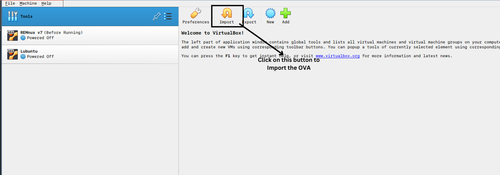

Follow the Link to the Drive Folder that contains the OVA file for the Forensic Analysis VM.
Install the OVA file, and launch Virtual Box

In Virtual Box, you should have an option called as Import.
After clicking on the **"Import"** button, it should open another window that will ask for the path to the OVA file.



Guide VirtualBox to wherever you have saved the OVA file, and it should be imported into Virtual Box.

The name of the Virtual Machine is **Forensics Arch**, and check the Hardware before starting the VM once. I have allocated **8192 MB** of RAM and **4 Processors**. If your computer does not have that much free space, then reduce the amount of RAM that can be allocated.

The default username and password is **forensics** and **forensics** respectively. After logging in you'll be welcomed with a very minimal screen with only the File Manager. Since we'll be using a terminal for majority of the tools, let's see how to launch the terminal and its configurations

---
## Terminal

In order to launch the configured terminal, right click on the Desktop, then click on Launch Terminal. This will open a **`kitty`** terminal and uses `zsh` as the shell. It's not very different from the **`bash`** shell, and all your commands that you use in **`bash`** will work here as well.

Kitty + ZSH has also been loaded with Oh-My-ZSH and a few plugins to make working with the terminal much easier than normal. All of the applications that we will be launching will be from the terminal, so it's good if you can get used to it

If you feel like kitty is not for you, then you can choose to use MATE's default terminal by going to Applications in the top left corner, and choosing **`MATE Terminal`**

---
## Package Manager

This particular virtual machine uses **`pacman`** as the package manager because it's Arch Linux. So if you are used to Ubuntu or Kali Linux, you'll be installing packages through `apt`.  When it comes to Arch Linux, you'll be using `pacman` to do so. Here are some important commands that you need to keep in mind when using `pacman`

```shell
sudo pacman -Syu # This command updates and upgrades your machine
sudo pacman -Syu <package_name> # Upgrades and installs package
sudo pacman -S <package_name> # Installs package without upgrading system
```

The advantage that Arch Linux has over other distributions of Linux is the Unofficial Repository (AUR). It's a user maintained repository of packages that are not available in the main repositories. In order to install anything from the unofficial repository, use the following command

```shell
yay -S <package_name>
```

In order to check where the packages are, you can search through the [Official Repository](https://archlinux.org/packages) or the [Unofficial Repository](https://aur.archlinux.org/packages). If you find the file in the Official Repository, it can be installed using **`pacman`**, and it you find it in the AUR, then it can be installed with **`yay`**

---
## Tools

These are the tools that are preinstalled into the VM provided:
- Aurora Incident Response
- Velociraptor
- RegRipper
- Regshell
- Wireshark
- tshark
- exiftool
- exiv2
- steghide
- stegsolve

---
### Aurora Incident Response

Aurora is a tool that makes Incident Response Documentation very easy. In large investigations, it's very easy to lose track of all the finding. This makes them fail to see what they are missing. In order to make the documentation very simple and easy, this tool can be used in both small investigations and large ones.

It also allows for investigators to make Graphs to show Lateral Movement of Data, and a Visual Timeline that can be used to show the chronological order. Aurora also supports Tab View which includes different functionalities like:
- Timeline
- Investigated Systems
- Malware/Tools
- Compromised Accounts
- Network Indicators

In order to launch Aurora in the Virtual Machine, open a terminal and head over to the Programs folder present at home and launch it from the Aurora folder
```shell
cd ~/Programs/Aurora-linux-x64
./Aurora
```

Just by doing so, Aurora Incident Response will now be up and running.

---
### Velociraptor

Velociraptor is a tool that is made for endpoint monitoring. It allows investigators to respond to a range of breaches by allowing:
- Reconstruction of attacker activities
- Hunt for evidence
- Investigate malware outbreaks
- Gather endpoint data

Velociraptor is a very flexible tool thanks to the query language that it uses, **Velociraptor Query Language**. It's a framework to make highly customized artifacts which can be used to monitor, collect and query any aspect of the endpoint. This application is interacted through with the browser.

```shell
cd ~/Programs
./velociraptor
```

After running the above command, firefox should open and lead you to the Velociraptor home page after where you can start performing investigations

---
### Regripper

`RegRipper` is an open source forensic tool designed for extracting, analyzing and parsing the Windows Registry. It operates through a series of Perl scripts and plugins that target specific Registry Hives, making it a very powerful tool when analyzing Registry Hives. It also automates the process, thus reducing the risk of Manual Errors and speeds up investigations

#### CLI RegRipper
```shell
cd ~/Programs/RegRipper3.0
perl rip.pl
```

#### GUI RegRipper
```shell
cd ~/Programs/RegRipper3.0
wine rr.exe
```

#### Analyzing the Registry

**Step 1: Prepare the Environment**
- Copy the hive files form the target machine into the forensic environment

**Step 2: Load in RegRipper**
- If you are using the GUI, then you can Browse for the file and load it in RegRipper, then **`Rip It`**
- If you are using the CLI, then you can run the following command to load the Registry File
```shell
regripper -r <path_to_hive> -f <plugin>
```
The plugin is optional and not a mandatory flag

---
### Regshell

Regshell is a utility that allows us to browse through a Windows Registry File as though it was a normal file system. This utility is not available on Windows, and is a Linux-only CLI based utility. Regshell is part of the Samba suite and Samba is a re-implementation of the SMB protocol on Windows, thus allowing file and print sharing between Windows machines and laptops that need Unix.

In order to launch the utility, all you have to do is enter this in the command line
```shell
regshell --help
```

This will launch the help menu and tell you how to use the regshell utility. An example usage of regshell to go through a registry hive is
```shell
regshell -b nt4 NTUSER.DAT
```

Here we are telling regshell that the backend we are giving is of an nt4 registry file, and the file name is NTUSER.DAT

When we run this command, we get another shell which allows us to go through the registry hive as though it was a file system on Linux. There is no GUI for this, so some usage of Unix commands are required

---
### Wireshark

Wireshark is a popular and widely used tool when it comes to network monitoring and analysis. Wireshark is a tool that allows the investigator to see all the traffic on the network that is not sent to our machine. The investigator can also put the network interface controller into promiscuous mode to view _all_ the traffic.

Since this tool needs direct access to the Network Interface, it requires super user privileges to be run
```shell
sudo wireshark
```

Wireshark contains many features and some of them include:
- Data can be dumped into a `pcap` file or can be read from a `pcap` file to be analyzed
- Live data can be recorded from networks like Ethernet, 802.11, PPP and loopback
- Captured packets can be edited to falsify information
- Many different filters allow us to choose what kind of packets we need
- Voice over Internet Protocol calls can also be captured and detected. If it is encoded in a compatible format, then the media can also be played

Wireshark is a GUI based application, but there is also a command line utility called as `tshark`

---
### Tshark

Tshark is also a network traffic capture and analysis tool, unlike Wireshark, this is a command Line Utility. It uses the same packet capture library as Wireshark as well. Tshark is used when we need to automate some of the processes and for scripting.

Filtered and captured packets can be exported to different formats like CSV, JSON and XML. This makes it a useful tool for consolidating all of the output packets. To run tshark, run
```shell
tshark
```

This command will throw an error saying permission denied. Just like how Wireshark requires superuser privileges, tshark also requires sudo privileges. Here's how to capture all of them traffic on the wireless interface
```shell
sudo tshark -i wlan0
```

The `-i` flag tells tshark what interface has to be monitored and captured. The above command will capture every packet that goes through the wireless interface. If we want to limit the number of packets captured, we can add the `-c` flag, which stands for `count`
```shell
sudo tshark -i wlan0 -c 3
```

This will capture only 3 packets on the wireless interface. In order to write all of this data to an output file to be analyzed, you can use the `-w` flag, which is to write. By default tshark writes to a .pcap file, but it can also be exported to different formats
```shell
sudo tshark -i wlan0 -c 3 -w output.pcap # Write the three packets picked up on wireless to output.pcap

sudo tshark -i wlan0 -T pdml > capture.xml # To convert the data to an XML format for easy reading
```


You can also read and analyze pcap files using the `-r` flag
```shell
sudo tshark -r output.pcap # To view the captured information as a raw pcap

sudo tshark -r output.pcap -T json # To view captured information in JSON format
```

More filters and additional settings are also present, to learn everything you can use the manpage or the tldr page
```shell
man tshark # Outputs all the information about tshark

# If you feel like man is too much information, then install tldr and run
tldr tshark
```

---
### Exiftool

Exiftool is a very powerful command line utility for reading, writing and editing metadata in a wide variety of file formats, including images, videos, audio and documents. This also supports a wide range of metadata standards like EXIF, IPTC and XMP.

#### Reading Metadata
Exiftool can be used to analyze files for hidden metadata which includes information like timestamps, camera models, geolocation data, editing software and many more.

To view the metadata of a file, run:
```shell
exiftool file.jpg
```

This will display all of the metadata available in the file, including the camera settings, timestamps, comments and more information. Metadata is written to STDOUT and hence cannot be shared very easily, so to export the metadata into a file for easy reading and sharing, you can use the `-o` flag, that stands for output

```shell
exiftool file.jpg -o metadata.txt
```

#### Writing Metadata
Exiftool can also be used to modify the metadata. To change any particular tags in the file's metadata, you can do this
```shell
exiftool -tag=<modified_metadata> file.jpg
```

For example, if you want to change the "Author" field of the image, you can run
```shell
exiftool -Author="Anirudh Revanur" file.jpg
```
This command will overwrite the existing Author's data, or if there is no author, it will overwrite the data.

#### Removing Metadata
To strip the file of **all** metadata and leaving only the content behind, you can use the `-all` flag. This will leave only the media and strip all the metadata from it. It's useful for ensuring privacy when sharing files online

```shell
exiftool -all= file.jpg
```

This is following what we did above in writing metadata. In this case, we are writing `all` the metadata to be empty or equal to NULL. That's how it strips metadata from an image.

#### Exporting Metadata
Exiftool supports various formats of metadata exports such as JSON and XML. In order to export the metadata into JSON, you can run the following

```shell
exiftol -json file.jpg > metadata.json
```
This command will save all of the metadata of `file.jpg` into a JSON file for easy reading

#### Bulk Processing
In some scenarios, we might get an entire folder of data, and instead of manually performing checks on each one of these images, you can just input the path to the parent directory and exif will process all the files within it

```shell
exiftool /path/to/parent
```

#### Help
For further reading on Exiftool, you can visit the [website](https://exiftool.org/) or you can use the man/tldr commands to view all the commands you can run.

```shell
man exiftool
tldr exiftool
```

---

### Exiv2
Exiv2 is also a command line utility that allows us to manage image metadata. It's also used for writing and reading metadata from images. It's very lightweight and efficient, thus making it a good choice for forensics and metadata analysis

```shell
exiv2 file.jpg # Shows a summary of all the metadata
exiv2 -pa file.jpg # Shows all the metadata in a detailed format
```

Just running exiv2 with the path to the image will read the metadata, and adding the `-pa` flag will make it a more detailed list format

Writing metadata using exiv2 is not as straightforward as how it was in Exiftool. You have to modify the tags manually like so
```shell
exiv2 -M"set Exif.Image.<tag> 'New Description'" file.jpg
```

This command will set the respective tag to the new description. To change the Image Description for example, we can do this
```shell
exiv2 -M"set Exif.Image.ImageDescription 'My Title'" file.jpg
```

To remove all the metadata from an image and keeping only the image itself, you can just run
```shell
exiv2 rm file.jpg
```

You can export and import metadata from an XML file by doing this
```shell
exiv2 -eaX file.jpg # To export the metadta contents to an XML file
exiv2 -iaX file.jpg # To import the XML metadata into the image again
```

For managing bulk processing, we have to name all of the files that have to be processed and we can't just name the parent folder
```shell
exiv2 file1.jpg file2.jpg...
```

For more information regarding exiv2, you can use the man pages for usage guidance
```shell
man exiv2
```

---
### ExifTool vs Exiv2

Both ExivTool and Exiv2 are popular command line utilities for working with metadata in images and they are both used in forensic investigation. Here are the differences and the different use cases that they have to be used in to hit their peak performance

|          Feature           |                              ExifTool                               |              Exiv2               |
| :------------------------: | :-----------------------------------------------------------------: | :------------------------------: |
|   Supported File Formats   |                    Images, Videos, Audios, PDFs                     |     Images (JPEG, PNG, TIFF)     |
| Supported Metadata Formats |   EXIF, IPTC, XMP and custom tags. Also supports advanced formats   |        EXIF, IPTC and XMP        |
|       Output Format        |        Export to JSON, XML, CSV for more structured analysis        | Export metadata only to XML only |
|       Customization        | Highly customizable. Supports detailed tag edits and custom scripts | Limited only to metadata editing |

ExifTool is a much more powerful and versatile tool that works with multiple file formats and metadata standards. It's very useful when it comes to working in Digital Forensics and Investigations

Exiv2 is a more lightweight tool that is made just for images and is a much more lightweight tool.

What you use and how you use it up to you as long as you get the work done. It's important to have the documentation on what you've done


This is a basic walkthrough on how to import the custom Forensic OVA and a basic info on some of the tools available in this Custom Linux VM. It's your duty to use these tools and the knowledge you gained responsibly. Have fun with your investigations!
