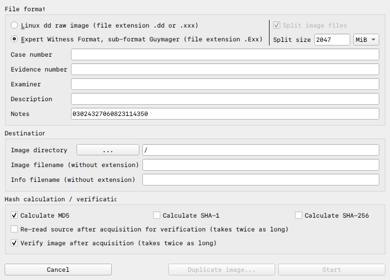
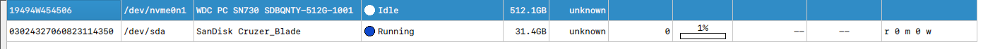

### Introduction to `Guymager`
`Guymager` is a lightweight, open-source forensic imaging tool made for Linux distributions. It supports multiple image formats (dd, E01 and AFF), provides detailed logs and ensure integrity checks during the imaging process. It provides a GUI for the users who do not want to take the risk of wiping disks with `dd` and the GUI provides a very comfortable and easy to use interface

**NOTE: All screenshots seen in this particular document are taken on Arch Linux**

---
### Installing `Guymager`
`Guymager` can be installed with the default repositories that are provided with the distributions.
1. **Debian based Distributions:**
```shell
sudo apt update
sudo apt install guymager
```

2. **Arch based Distributions:**
```shell
git clone https://aur.archlinux.org/guymager.git
cd guymager/
makepkg -si
```

3. **RPM Packages:**
	- Visit the webpage [pkgs.org](pkgs.org/download/guymager)
	- Choose the right Architecture and Operating System
	- Install the `.deb` or the `.tar.xz` file and extract from there

---
### Launching `Guymager`
`Guymager` is a tool that needs access to the hardware drivers and a normal user does not have those privileges, so we always have to run it using `sudo`

```shell
sudo guymager
```

This will launch the `guymager` UI and will allow us to make forensic images of the disks.

---
### Creating a Forensic Image

**Step 1:** Connect the target device and note down it's Linux device path. We do not want to accidentally clone our own disk or perform any changes to our own disk, so make sure that you know prior which disk is yours

*Tip: If you are not sure what disk is what, then open `guymager` first without connecting the device, make a note of all available disks, then connect the USB drive*

**Step 2: Start the Imaging Process**
1. In the `Guymager` interface, click on the device that has to be imaged


In this case, `/dev/nvme0n1` is the name of my local SSD and `dev/sda` is the USB drive that I have to make an image of

2. Right click on the device and choose **`Acquire Image`**


This is the UI that will pop up after clicking on **`Acquire Image`**

3. Configure the image settings
	- Choose what file extension the image has to be in
	- Choose where the image has to be stored
	- Select and verify the validity of the image with the hash algorithms `MD5`, `SHA-1` and `SHA-256`

4. Click `Start` to begin the imaging process
	- A progress bar will appear at the disk to show how much has been done


**Step 3: Verify the Image**
Once the imaging process is complete, you can tell `Guymager` to verify the image or you can just have it calculate the hash values.

If `Guymager` is the one verifying the image, then it will take twice as long as normal, but if you prefer to do it manually, then you can use command line utilities like `md5sum` or `sha256sum` to verify the image's hash

--- 
### Best Practices

1. Always use a write blocker so that the device is not changed during the acquisition process
2. Create Multiple Copies of the Image file. `Guymager` provides you the option of making multiple copies
3. Verify Integrity

--- 
### Disadvantages

1. **Linux-Only:** This tool is not natively available on MacOS or Windows (Or is that an advantage)
2. **Memory Acquisition:** Cannot create RAM dumps or create images of volatile memory
3. **GUI:** It's a Linux tool that has a GUI... Need I say more?

---
### Alternatives

The only reason we need "Alternatives" is for making the RAM dump, but we have tools like `LiME` to do that for us
