- **What is hash of the image?**
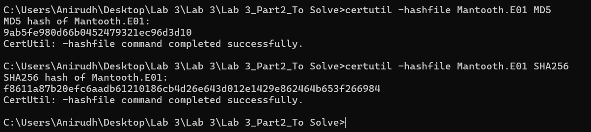
`Using certutil to get the hashes`
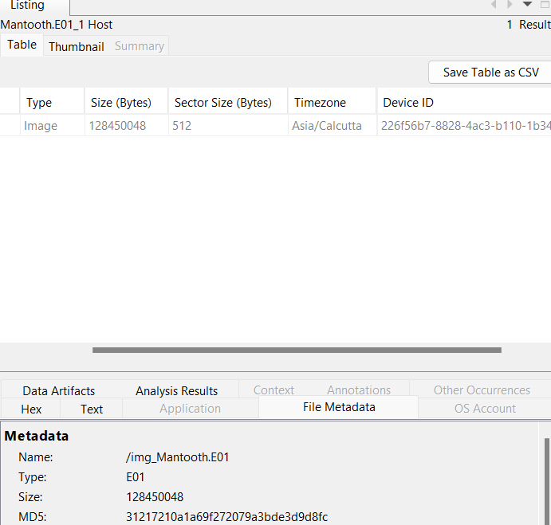
`Getting it in the Metadata of Autopsy`

- **What is the Operating System installed?**
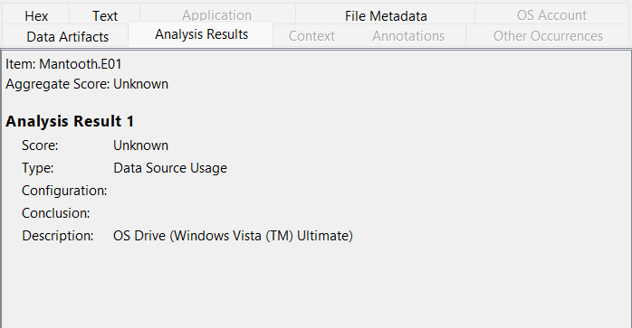
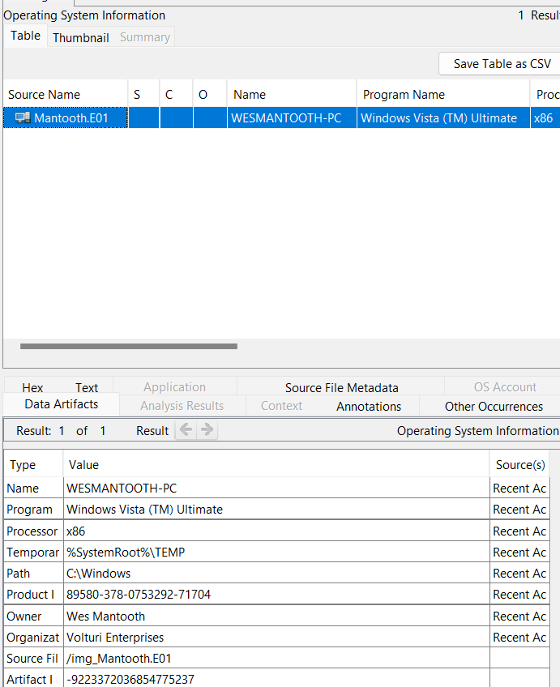
`Windows Vista Ultimate`

- **When was the Install Date?**
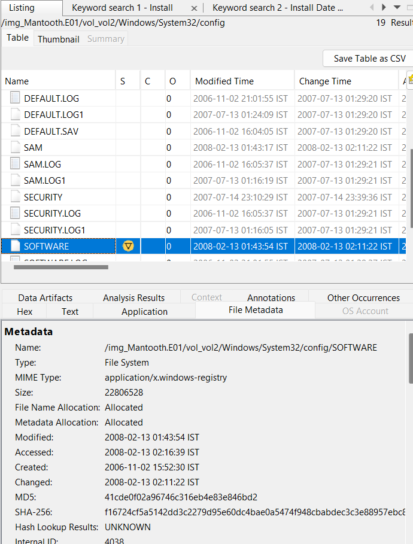
We see that the create date for the `SOFTWARE` date is on `2006-11-02` indicating that the Windows machine was most probably installed or first initialized on this date

- **What is the timezone Settings?**
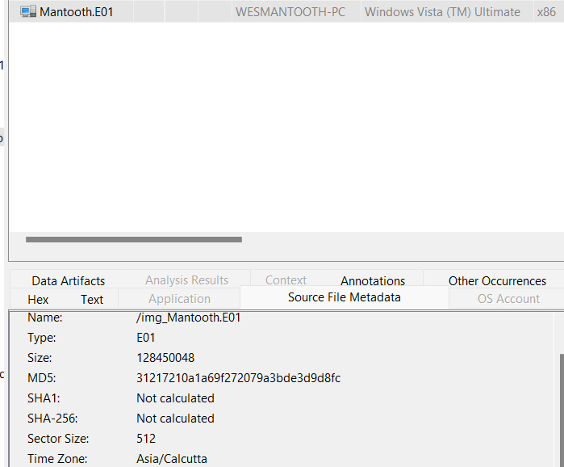
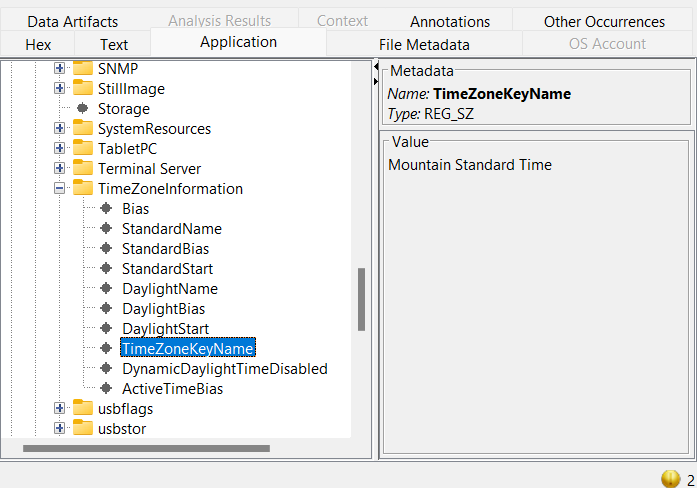
`Mountain Standard Time`

- **Who is the Registered User?**
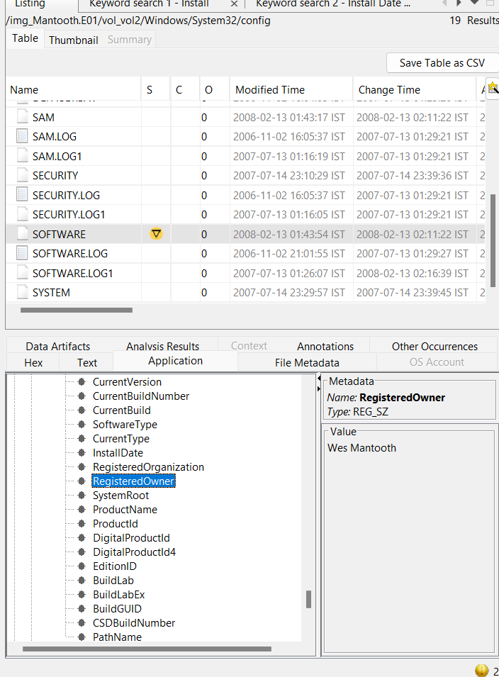
On going to the `SOFTWARE` hive again, and scrolling through the keys, we see a key called as `RegisteredOwner` and the value for this is `Wes Mantooth`

- **What is the Computer Account Name?**
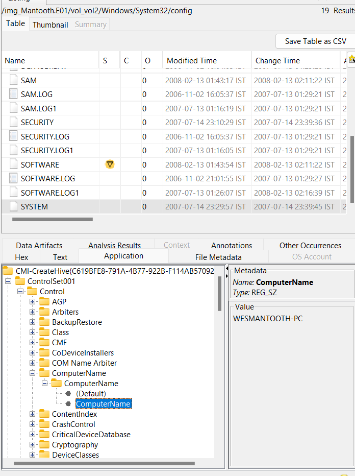
Computer Account Name is also known as the `ComputerName`. On searching for this Computer Name, we see that the name of the Computer is `WESMANTOOTH-PC`

- **What is the Primary Domain Name?**
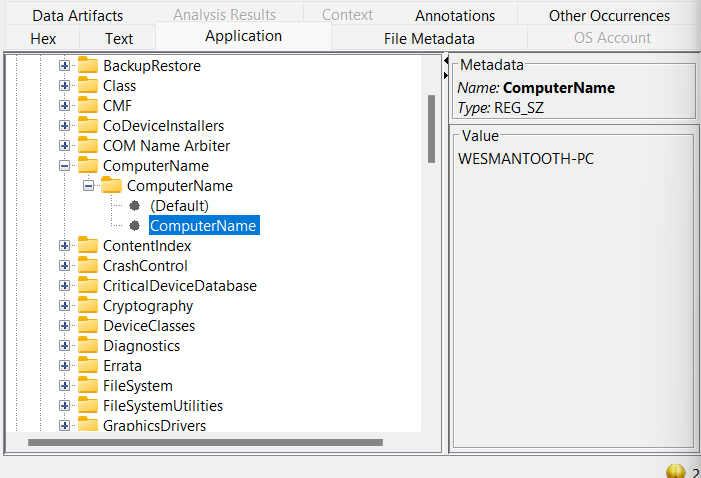

- **When was the last recorded Shutdown date/time?**

?????????????????

- **How many Accounts are recorded?**
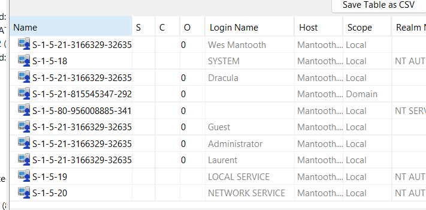
`Wes Mantooth`, `Dracula`, `Guest`, `Administrator`, `Laurent`

- **Account name that uses the machine the most?**
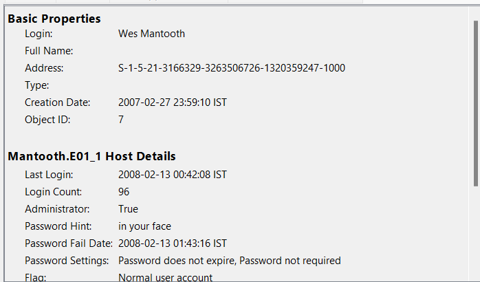
`Wes Mantooth` logged in 96 times

- **Last user to Logon?**

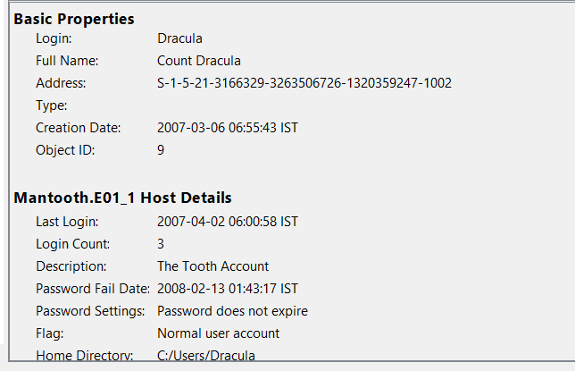
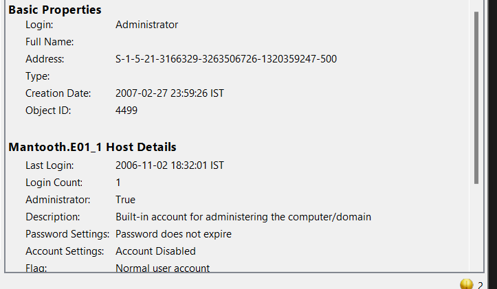

Here we see that `Wes Mantooth` has the most recent login. `Guest` and `Laurent` haven't been logged in at all, so no point in comparing them

- **A search for the name of “Wes Mantooth” reveals multiple hits. One of these proves that Wes Mantooth is the administrator of this computer. What file is it?**

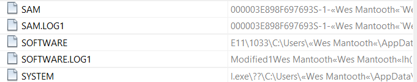

Access to all of these Registry Keys indicate that `Wes Mantooth` is the Administrator of the computer

- **List the Network Cards used by this computer**
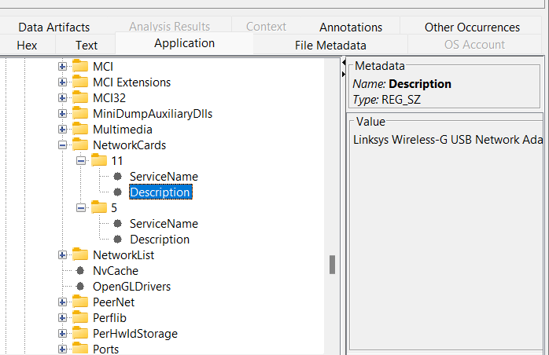
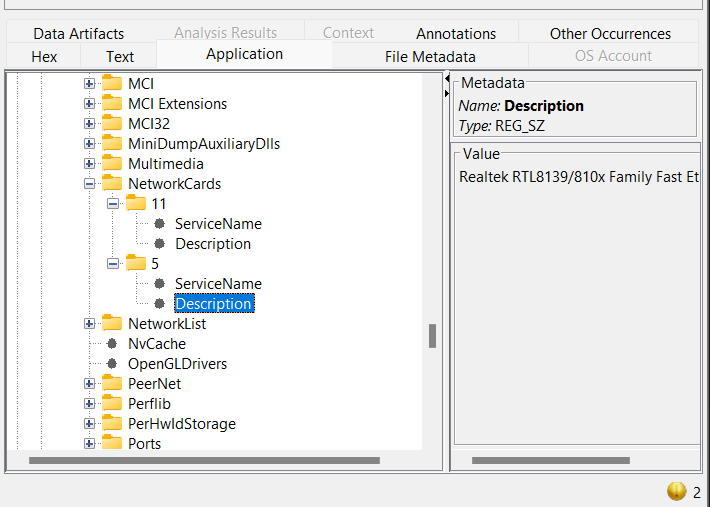
These are the Two Network Cards used by this machine

- **Find tools that may be used for Digital Forensics/Hacking**
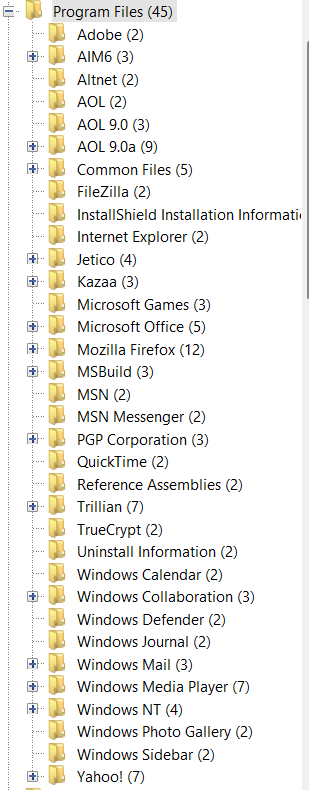
In this entire list of applications, we see some files like `FileZilla`, `TrueCrypt`, `BestCrypt`. All these programs are potentially dangerous and can be used for malicious purposes

- **Which email client is used by Wes Mantooth?**
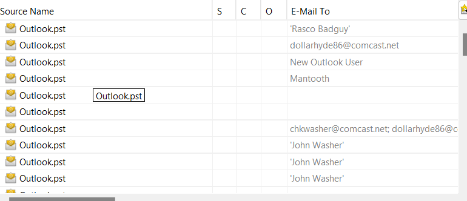
Outlook

- **How many executable files are in the Recycle Bin?**
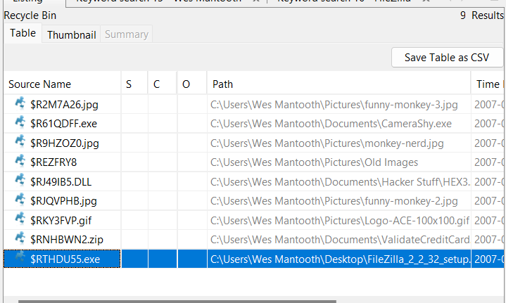
2 executables are in the Recycle Bin, namely `CameraShy.exe` and `FileZill_2_2_32_setup.exe`

- **How many files are actually reported to be deleted by the system?**
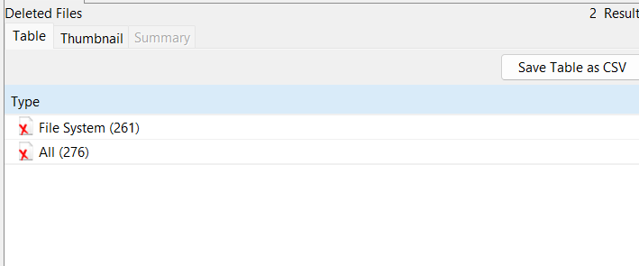
`276` files in total are deleted

- **Are there any viruses on the laptop?**
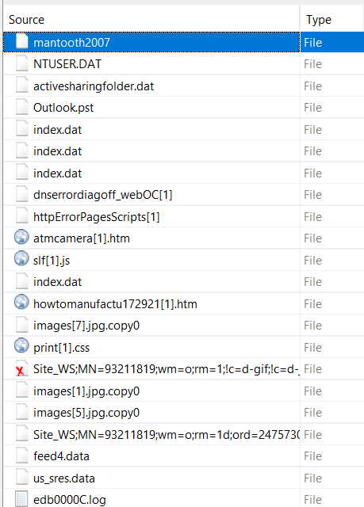
Not really, dude just has a lot of Outlook Attachments(.eml files). There are two files with encryption on them, so we can't really judge

- **Is there encryption Software?**
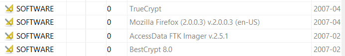

TrueCrypt and BestCrypt are Encryption softwares

- **What was the most visited domain and how many times was it visited?**
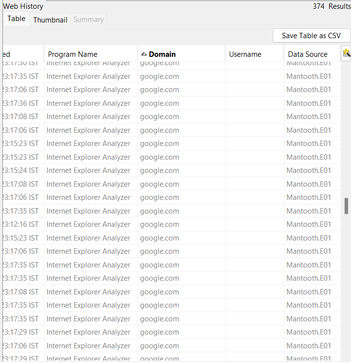
`google.com` was visited 149 times
